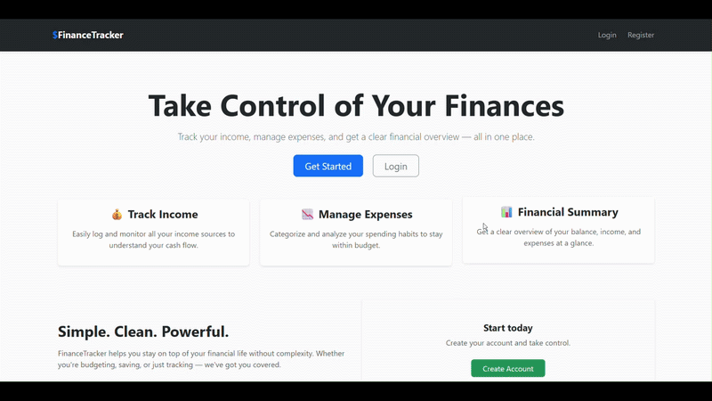
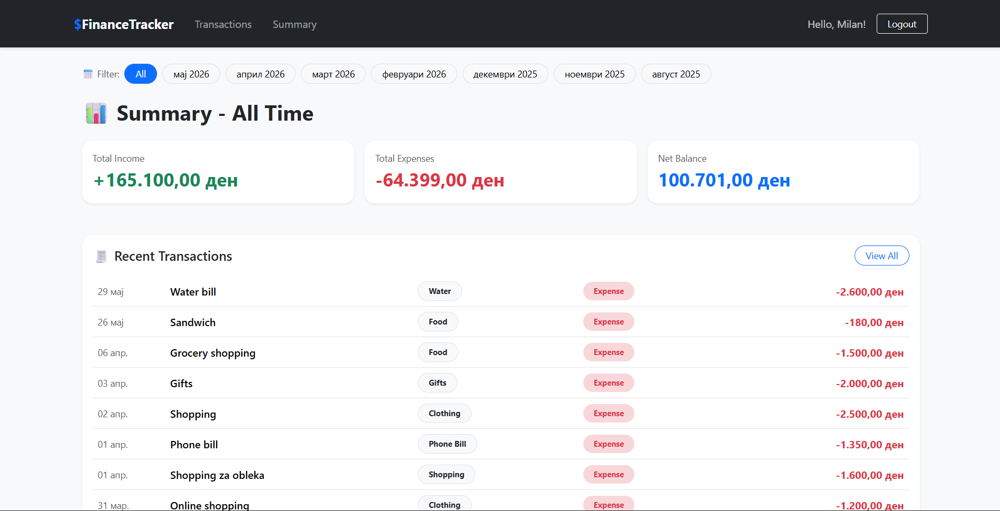

# 💰 Finance Tracker App

A modern and feature-rich personal finance tracking web application built with **ASP.NET Core MVC**, **Entity Framework Core**, and **Microsoft SQL Server**.

The application allows users to securely manage income and expenses, analyze monthly financial activity, filter and sort transactions, and maintain complete financial oversight through a clean and responsive user interface.

---

# ✨ Application Preview

## 🔐 Authentication & Dashboard

<p align="center">
  
</p>

---

## 📊 Monthly Financial Summary

<p align="center">
  
</p>

---

# 🚀 Features

## 🔐 Authentication & Security
- User Registration
- Secure Login & Logout
- ASP.NET Core Identity integration
- Authentication-protected routes and actions
- Session-based user authorization

---

## 💵 Transaction Management
- Create income transactions
- Create expense transactions
- Edit transactions
- Delete transactions
- View transaction details
- Category-based transaction organization

---

## 🔎 Advanced Filtering
Filter transactions by:
- Category
- Income / Expense type
- Date range
- Description keyword

---

## 📈 Sorting & Analytics
- Sort transactions by:
  - Amount
  - Date
  - Ascending / Descending
- Monthly financial summaries:
  - ✅ Total Income
  - ❌ Total Expenses
  - 📊 Net Balance

---

## 🧱 Architecture & Design Patterns
- Repository Pattern
- Service Layer Architecture
- DTOs (Data Transfer Objects)
- ViewModels
- AutoMapper Integration
- Clean Separation of Concerns

---

# 🛠️ Tech Stack

| Technology | Purpose |
|---|---|
| ASP.NET Core MVC | Backend Framework |
| C# | Main Programming Language |
| Entity Framework Core | ORM |
| SQL Server | Database |
| ASP.NET Core Identity | Authentication & Authorization |
| AutoMapper | Object Mapping |
| Bootstrap | Frontend Styling |
| LINQ | Data Querying |

---

# 📁 Project Structure

```txt
FinanceTrackerApp/
├── Areas/
├── Assets/
│   ├── HomeLoginIndex.gif
│   └── Summary.png
├── Controllers/
├── Data/
├── DTOs/
├── Helpers/
├── Interfaces/
├── Mappings/
├── Migrations/
├── Models/
├── Repositories/
├── Services/
├── ViewModels/
├── Views/
├── wwwroot/
├── Program.cs
├── appsettings.json
└── ScaffoldingReadMe.txt
```

---

# ⚙️ Getting Started

## 📋 Prerequisites

Before running the application, install:

- [.NET SDK](https://dotnet.microsoft.com/download)
- [Microsoft SQL Server](https://www.microsoft.com/en-us/sql-server)
- [SQL Server Management Studio (SSMS)](https://aka.ms/ssmsfullsetup)

---

# 🔧 Installation & Setup

## 1️⃣ Clone the Repository

```bash
git clone https://github.com/MilanBornarov/Finance-Tracker-App-DotNet.git
cd Finance-Tracker-App-DotNet
```

---

## 2️⃣ Configure Database Connection

Initialize User Secrets:

```bash
dotnet user-secrets init
```

Add your SQL Server connection string:

```bash
dotnet user-secrets set "ConnectionStrings:DefaultConnection" "Server=YOUR_SERVER;Database=FinanceTrackerDB;Trusted_Connection=True;"
```

Alternatively, you can manually update:

```json
appsettings.json
```

⚠️ Do not commit real database credentials.

---

## 3️⃣ Apply Database Migrations

```bash
dotnet ef database update
```

---

## 4️⃣ Run the Application

```bash
dotnet run
```

---

## 5️⃣ Open in Browser

```txt
https://localhost:5001
```

---

# 📚 Educational Purpose

This project demonstrates practical implementation of:

- ASP.NET Core MVC architecture
- Authentication & authorization systems
- Entity Framework Core
- SQL Server integration
- Repository & Service patterns
- DTO/ViewModel separation
- CRUD operations
- Advanced filtering & sorting
- Financial data management
- Clean software architecture principles

---

# 🔮 Possible Future Improvements

- Budget planning system
- Charts & financial analytics dashboard
- Recurring transactions
- Export to PDF/Excel
- Dark mode support
- Multi-currency support
- REST API integration
- Mobile-responsive redesign

---

# 👨‍💻 Author

## Milan Bornarov

- GitHub: https://github.com/MilanBornarov
- LinkedIn: https://www.linkedin.com/in/milan-bornarov-758371305/

---

# ⭐ Repository Support

If you found this project useful or interesting, consider giving the repository a ⭐ on GitHub.
